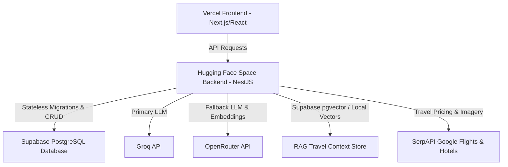

<p align="center">
  
</p>

<h1 align="center">JetSet.AI</h1>

<p align="center">
  <strong>Next-Gen AI-Powered Travel Planning Assistant.</strong>
</p>

<p align="center">
  <em>Most travel tools show you WHERE to go. JetSet.AI resolves HOW you get there.</em>
</p>

<p align="center">
  <a href="https://jet-set-ai.vercel.app"></a>
  <a href="https://samd445-jetset-ai.hf.space"></a>
  <a href="https://github.com/SAMBHAV001-tech/JetSet.AI"></a>
</p>

---

## 🌐 Live Deployment

| Service | URL |
| :--- | :--- |
| 🖥️ **Live Dashboard** | [jet-set-ai.vercel.app](https://jet-set-ai.vercel.app) |
| ⚙️ **Backend API** | [samd445-jetset-ai.hf.space](https://samd445-jetset-ai.hf.space) |
| 💖 **Health Check** | [samd445-jetset-ai.hf.space/health](https://samd445-jetset-ai.hf.space/health) |

> Cloud deployment includes UptimeRobot monitoring to prevent Hugging Face Space containers from sleeping during evaluations.

---

## 📖 Project Summary
**JetSet.AI** is an advanced, AI-driven trip planner designed to automate, optimize, and organize complex travel plans. Unlike traditional travel engines, JetSet.AI resolves itineraries, books flights, aggregates stays, and analyzes destinations dynamically based on real-time budget, travel dates, companions, and user interests. 

The application utilizes a stateless, high-availability architecture designed for seamless deployment across Vercel (frontend) and Dockerized Hugging Face Spaces (backend).

---

## 🛠️ Tech Stack & Architecture



### 1. Frontend
* **Framework:** Next.js (App Router) & React 18/19
* **Styling:** Vanilla CSS, Tailwind CSS for modular views, Glassmorphism panels
* **State & Data Fetching:** TanStack React Query (`@tanstack/react-query`)
* **Icons:** Lucide React

### 2. Backend
* **Framework:** NestJS (TypeScript / Node.js 20)
* **API Architecture:** RESTful Endpoints & Server-Sent Events (SSE) Streaming
* **Database Connection:** Pooling via `@types/pg` (Stateless connection recycling)

### 3. Caching & Storage
* **Primary DB:** Cloud Supabase PostgreSQL (Stateless; tables auto-initialize on boot)
* **RAG Context Store:** Supabase pgvector & Local Vector Memory Index

---

## ⚡ Key Optimizations & Design Patterns

### 🔄 Dual-LLM Parallel Racing & Fallback
To avoid Gemini API free-tier exhaustion and guarantee ultra-low latency:
* **The Race Pattern:** When both Grok and Gemini credentials are provided, non-streamed requests (such as destination validation or flight segment extraction) are fired **simultaneously in parallel**. Whichever replies first wins, immediately canceling the slower connection.
* **Circuit Breaker:** If Grok fails or acts slowly, its circuit opens for **30 seconds**. Subsequent requests bypass Grok entirely, going straight to Gemini to avoid timeout delays.
* **SSE Stream Fallback:** Combined trip generation streams start via Grok and seamlessly roll over to Gemini if the socket times out or disconnects.

### ⏱️ Proactive Health Wakeup System
Hugging Face Space free-tier containers hibernate after inactivity. To prevent users from waiting for boot delays:
* **Mount Ping Trigger:** The Next.js frontend triggers a fire-and-forget `GET /health` request the second the homepage loads. This warms up the container *while* the user fills out the trip wizard.
* **Boot Progress Indicator:** If the backend is asleep, the user is presented with a non-intrusive glowing loader box and a simulated container startup bar in the bottom right, while a glowing connection badge on the header changes state (`Active` | `Starting` | `Connecting`).

---

## 🚀 Setup & Deployment

### 1. Backend Local Setup
```bash
cd backend
npm install
npm run start:dev
```
Create a `.env` file in the `backend/` directory:
```env
PORT=3001
GEMINI_API_KEY=your_gemini_key
GROK_API_KEY=your_grok_key
SERPAPI_API_KEY=your_serpapi_key
DATABASE_URL=postgresql://postgres:...supabase.co:5432/postgres
```

### 2. Frontend Local Setup
```bash
cd frontend
npm install
npm run dev
```
Create a `.env.local` file in the `frontend/` directory:
```env
NEXT_PUBLIC_API_URL=http://localhost:3001
```

### 3. Production Deployment (Hugging Face + Vercel)
* **Backend:** Build and deploy using the root-level production `Dockerfile` on node alpine to [Hugging Face Spaces](https://huggingface.co/spaces/SamD445/JetSet_AI).
* **Frontend:** Connect the GitHub repository to [Vercel](https://vercel.com) for automatic CI/CD deployments on every push to `main`.
* **Uptime Keep-Alive:** To keep the free Hugging Face container awake, set up a free Uptime monitor (e.g. UptimeRobot) pointing to `https://samd445-jetset-ai.hf.space/health` checking every **30 minutes**.

---

## 🧪 Running Your First Trip Plan

If you'd like to test the full end-to-end flow locally:

1. Start the backend — `cd backend && npm run start:dev` (ensure `.env` is configured)
2. Start the frontend — `cd frontend && npm run dev`
3. Open [http://localhost:3000](http://localhost:3000) in your browser
4. Enter your trip details in the wizard:
   - `Origin` : Your departure city (e.g. `Mumbai`)
   - `Destination` : Where you want to go (e.g. `Paris`)
   - `Dates` : Travel window and number of companions
5. Hit **Plan My Trip** and watch JetSet.AI stream your itinerary, flights, hotels, and season analysis in real time

---

## 🤝 Contributing

Contributions, issues and feature requests are welcome!

1. Fork the repository
2. Create your feature branch — `git checkout -b feature/AmazingFeature`
3. Commit your changes — `git commit -m 'feat: Add AmazingFeature'`
4. Push to the branch — `git push origin feature/AmazingFeature`
5. Open a Pull Request

---

<p align="center">
  
  
  
  
  
  
</p>

<p align="center">
  <sub>Engineered with 🧭 for travelers who want smarter journeys, not just cheaper tickets.</sub>
</p>

